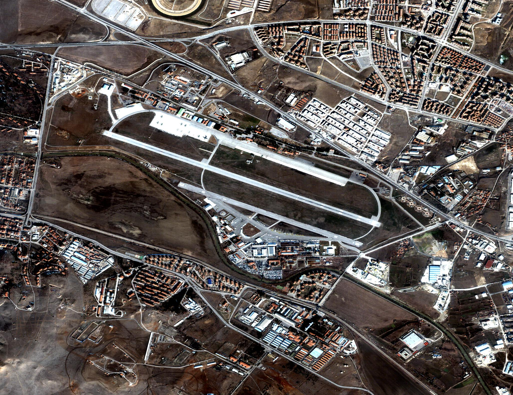
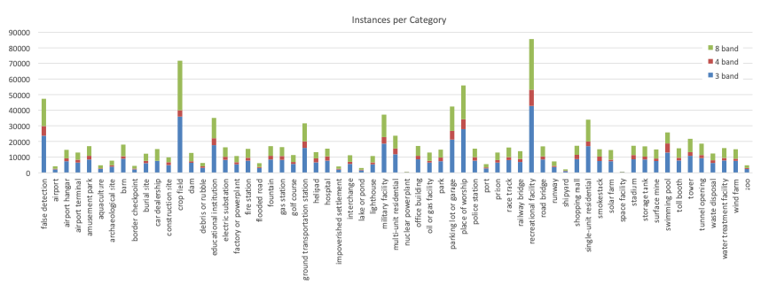

# FMoW: The Functional Map of the World Dataset

These are my notes on getting started with fMoW.

- Most of this info is from the fMoW paper: [arxiv:1711.07846](https://arxiv.org/abs/1711.07846)
- For download instructions see the [github.com/fMoW/dataset#download](https://github.com/fMoW/dataset#download)
- For citing fMoW see [github.com/fMoW/dataset#references](https://github.com/fMoW/dataset#references)

## Quick start

For an easy `ImageFolder`-compatible version of fMoW, use the [create_msrgb_imagefolder.py](https://github.com/mlaico/fmow-helper/blob/main/scripts/create_msrgb_imagefolder.py) script:

```txt
python create_msrgb_imagefolder.py --data_dir <path_to_fmow> --dst_dir <path_to_new_dst>
```

### Folder structure

The fMoW folder structure almost adheres to the PyTorch `ImageFolder` format, but not quite.  Within each class folder there are subfolders that each correspond to a particular location - as in, a location on the Earth where a structure/facility of the respective category is present. Each of these subfolders holds many images and metadata for its particular location taken at different times e.g. ~months apart.  The overall folder structure is depicted below:

```txt
fMoW
    \
     |-- train
     |        \
     |         |-- class1
     |         |         \
     |         |          |-- class1_0
     |         |          |           \
     |         |          |            |-- class1_0_0_msrgb.jpg
     |         |          |            |-- class1_0_0_msrgb.json
     |         |          |            |-- class1_0_0_rgb.jpg
     |         |          |            |-- class1_0_0_rgb.json
     |         |          |            |-- ...
     |         |          |            |-- class1_0_<n>_msrgb.jpg
     |         |          |            |-- class1_0_<n>_msrgb.json
     |         |          |            |-- class1_0_<n>_rgb.jpg
     |         |          |            |-- class1_0_<n>_rgb.json
     |         |          |-- ...
     |         |          |-- class1_<n>
     |         |-- ...
     |         |-- class<n>
     |-- val
            \
             |-- class1
             |-- ...
             |-- class<n>
```

As an example, the first class in alphabetical order is "airport" and within the *airport* train folder, there are 463 locations:

```txt
fMoW
    \
     |-- train
     |        \
     |         |-- airport
     |         |          \
     |         |           |-- airport_0
     |         |           |-- ...
     |         |           |-- airport_462
```

Within the first location, `airport_0`, we see that there are 8 *temporal views* (0 ... 7):

```txt
|-- airport
           \
            |-- airport_0
                         \
                          |-- airport_0_0_msrgb.jpg
                          |-- airport_0_0_msrgb.json
                          |-- airport_0_0_rgb.jpg
                          |-- airport_0_0_rgb.json
                          |-- ...
                          |-- airport_0_7_msrgb.jpg
                          |-- airport_0_7_msrgb.json
                          |-- airport_0_7_rgb.jpg
                          |-- airport_0_7_rgb.json
```

Notice that there are 4 files for each view: two types of images, each with a dedicated json metadata file.  Let's start with the two image types `msrgb` and `rgb`:

 - **msrgb**: This format results from extracting the *red*, *green*, and *blue* channels from a multispectral (ms) image which originally contained either 4 or 8 channels in total. The extra channels correspond to different wavelengths of light both in the visible spectrum and "near-infrared" (NIR):

    > 
    > [img src: Maxar blog post on MSI](https://blog.maxar.com/earth-intelligence/2017/uncovering-hidden-intelligence-with-multispectral-imagery)

    > Here is the msrgb image `airport_0_0_msrgb.jpg`:
    > 

 - **rgb**: This format combines the rgb data with a *panchromatic* image (i.e. single-channel a.k.a grayscale) that was taken simultaneously at a much higher resolution. The merging of the two resolutions happens through an image processing technique called *pan-sharpening*.  The result is a high-res, color image

    > 
    > [img src: Maxar blog post on MSI](https://blog.maxar.com/earth-intelligence/2017/uncovering-hidden-intelligence-with-multispectral-imagery)

    > Here is the *pan-sharpened* rgb image `airport_0_0_rgb.jpg`:
    > 

    > - In terms of visual appearance, we can see that the pan-sharpening process yields a sharper image with less saturated colors.
    > - The big difference is the resolution (image size).  This pan-sharpened rgb image is 8200 x 6312 pixels, whereas the msrgb image is 2050 x 1578


## fMoW stats

### Temporal views

As mentioned above, each location in each class has multiple images taken at different times.  The fMoW paper refers to these as "temporal views".  To answer the question, "how many temporal views does each location (area) have?", the paper provides a plot of the distribution:


Looking at this, we could say most of the dataset has 5 or less views.  It is noted in the paper that the max number of views for any single area is 41.

### Instances per class

The total instances per class are unevenly distributed:



- The above fig includes temporal views of the same area
- Don't mind the red/green bars, unless you're working with the 4- or 8-channel multispectral imagery.
